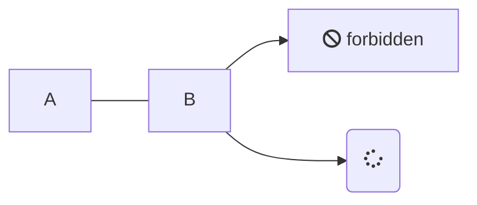
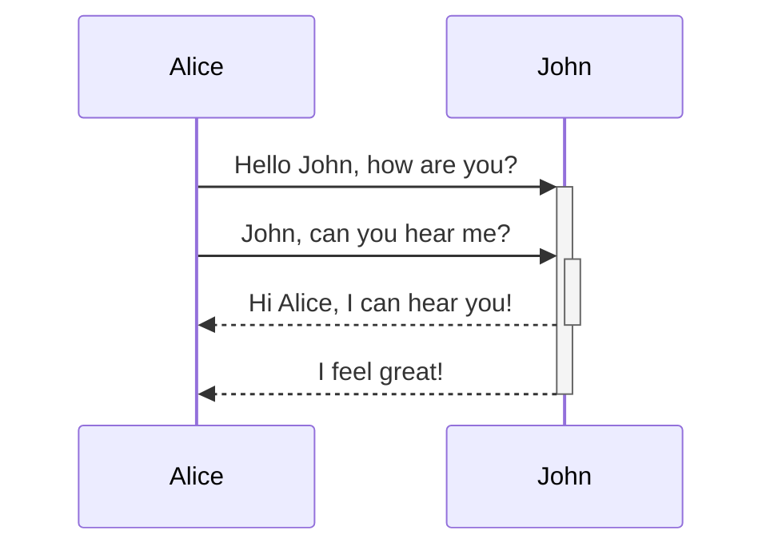
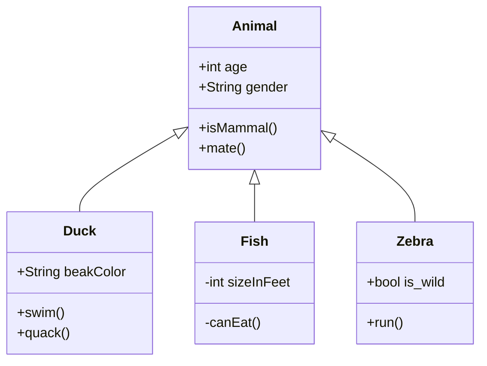
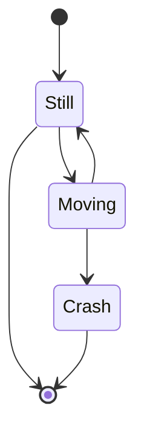
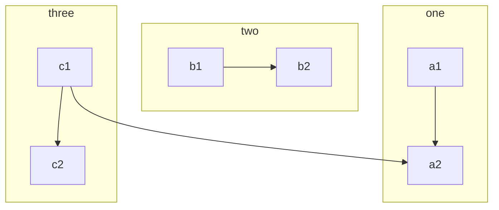

# 2021.04.11 - Test

Loriem ipsum

## data visualization

## mermaid

### graph

### sequence

### class

### state

### subgraphs

## graphviz

### graph


a -- b
b -- c
c -- a


## bibliography





